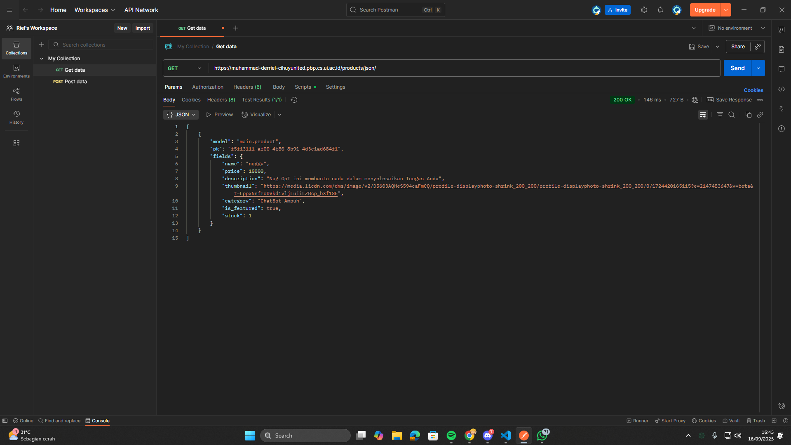

Nama : Muhammad Derriel Ramadhan

NPM : 2406345186

Kelas : PBP F

https://muhammad-derriel-cihuyunited.pbp.cs.ui.ac.id/

1. Jelaskan mengapa kita memerlukan data delivery dalam pengimplementasian sebuah platform?
    Data delivery pada dasarnya adalah proses mengantarkan data dari satu titik ke titik lain (misalnya dari server ke client, antar service, atau antar pengguna) dengan cara yang tepat, cepat, aman, dan dapat diandalkan.
    Kita memerlukan data delivery dalam pengimplementasian sebuah platform karena:
    -Akses Informasi oleh Pengguna
    Platform apa pun (e-commerce, media sosial, sistem akademik, dsb.) bergantung pada data. Tanpa mekanisme pengantaran data yang baik, pengguna tidak bisa melihat produk, mengakses profil, atau membaca konten secara real-time.
    -Konsistensi dan Keakuratan Data
    Data delivery memastikan informasi yang diterima pengguna selalu konsisten dengan yang ada di server. Contoh: ketika kamu melakukan transaksi, data pembayaran harus dikirim dan diproses tanpa salah agar saldo, stok, dan status pesanan sinkron.
    -Kecepatan dan Efisiensi
    Pengguna menuntut platform yang responsif. Data delivery yang baik mengoptimalkan waktu pengiriman sehingga platform bisa cepat, misalnya lewat caching, CDN, atau protokol komunikasi efisien.
    -Keamanan Data
    Dalam platform, data seringkali sensitif (password, data pribadi, transaksi). Mekanisme data delivery yang baik akan melibatkan enkripsi dan autentikasi supaya tidak mudah disadap atau dimanipulasi pihak ketiga.

2. Menurutmu, mana yang lebih baik antara XML dan JSON? Mengapa JSON lebih populer dibandingkan XML?
    JSON lebih populer dibandingkan XML karena lebih ringkas, mudah dibaca, lebih cepat diproses, dan langsung kompatibel dengan banyak bahasa pemrograman serta web modern. Sementara XML cenderung lebih berat dan kompleks, sehingga sekarang lebih banyak dipakai di sistem lama atau kebutuhan data yang sangat detail.

3.  Jelaskan fungsi dari method is_valid() pada form Django dan mengapa kita membutuhkan method tersebut?
    is_valid() pada form Django berfungsi untuk memeriksa apakah data yang dimasukkan pengguna sesuai aturan validasi. Kita membutuhkannya agar hanya data yang benar, aman, dan sesuai format yang diproses atau disimpan ke database.

4.  Mengapa kita membutuhkan csrf_token saat membuat form di Django? Apa yang dapat terjadi jika kita tidak menambahkan csrf_token pada form Django? Bagaimana hal tersebut      
dapat dimanfaatkan oleh penyerang?
    csrf_token pada Django berfungsi sebagai perlindungan terhadap serangan Cross-Site Request Forgery (CSRF) dengan memastikan setiap request form berasal dari pengguna yang sah, bukan dari situs luar yang mencoba memalsukan permintaan. Jika kita tidak menambahkan csrf_token, aplikasi akan menjadi rentan sehingga penyerang dapat memanfaatkan sesi login pengguna untuk mengirim request berbahaya, seperti mengganti password, melakukan transaksi, atau menghapus data, tanpa sepengetahuan dan persetujuan pengguna.

5.  Jelaskan bagaimana cara kamu mengimplementasikan checklist di atas secara step-by-step (bukan hanya sekadar mengikuti tutorial).
    cara saya mengimplementasikan checklist diatas berawal dari implementasi skeleton sebagai kerangka views lalu buat base.html lalu ubah code di main html dan membuat form input data dan tampilan data serta mengembalikan data dalam bentuk xml,xml by id,json dan json by id lalu kita buat semua fungsi itu mengikuti apa yang telah kita pelajari di tutorial , lalu kita gunakan postman

6.  Apakah ada feedback untuk asisten dosen tutorial 1 yang telah kamu kerjakan sebelumnya?
    Tidak ada,Semua tutorial sudah lengkap + mudah di mengerti.

